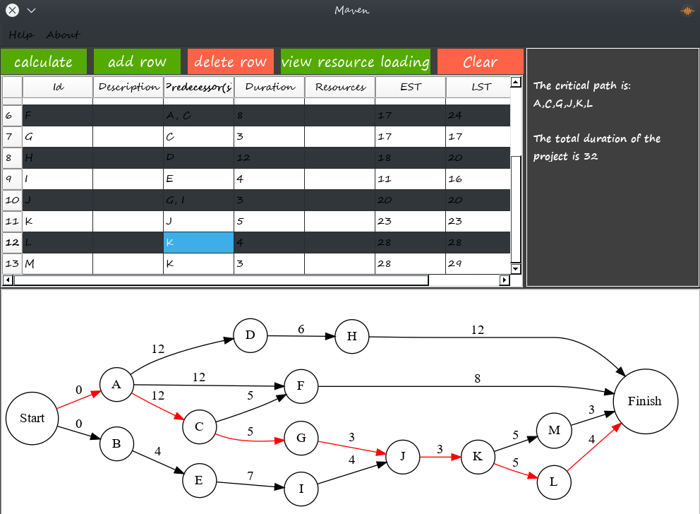

Maven
====================================================================

A small project management application that implements the critical path method to get the critical path in a set
of activities in a project, It also calculates the Earliest Starting Time and Latest Starting time of each activity,
Maven can also carry out the Resource Loading Excercise, directed graphs are automatically generated with Graphviz.

What can it do
-------------------
To be honest the UI isn't that great, but this is a glimpse of what Maven can do.



Implementation
--------------------

- Python3.4 to 3.6
- <s>PySide</s> PyQt4 (Unfortunately PySide development Stalled) Though it still works (If you change the imports to `PySide`)
- Graphviz (dot-language)
- graphviz (a python3 module for working with Graphviz)

Installation Guide
---------------------
Install PyQt4
There are Several Ways to install PyQt based on your OS and Distribution (If you're using Linux)

Install Graphviz (the dot language)
Also there are Various ways to Install this depending on your OS

Install Graphviz (From Pypi)
This is the only platform independent component, it can easily be installed from pip with

```bash
pip install graphviz
```

Make sure you have all the packages listed above installed before running and if you notice that the graphs are not generated
check make sure the Graphviz executable is in your system path (applies mostly to windows users)

Running
---------
Run the Application with:

```bash
python3 main.py
```
If you live in the past.

If you live in the future use

```bash
python main.py
```


Support
----------------------

If you are having issues or questions, please let me know.
osaetindaniel@gmail.com

License
-------

The project is licensed under the BSD license.
